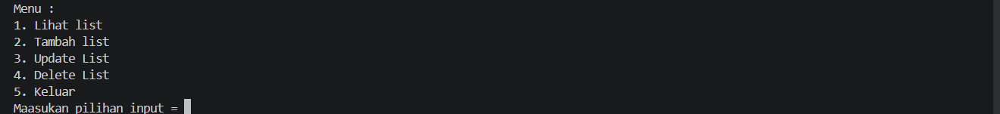
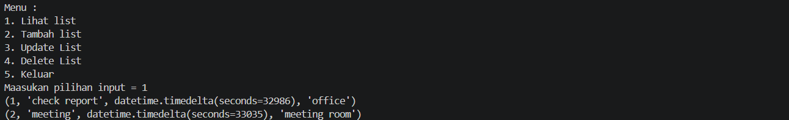
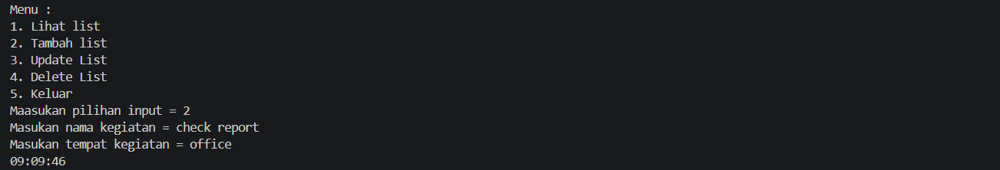
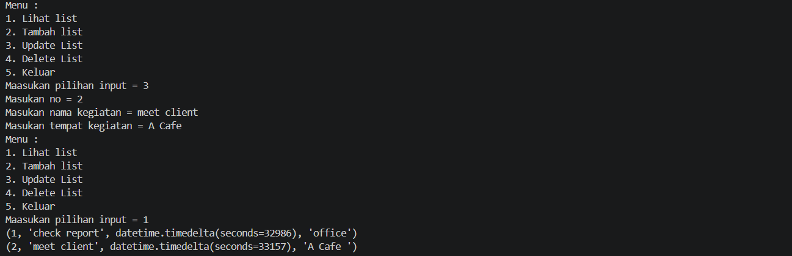
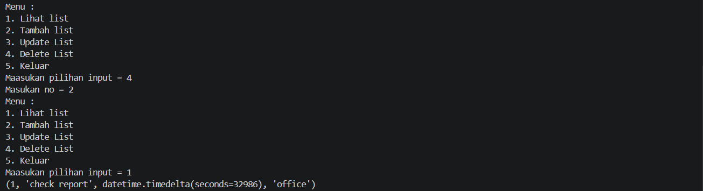

# Task Management System Using Python & MySQL

A simple CLI Task Management System built with Python and MySQL. This application allows users to manage daily activities through basic CRUD operations while storing data in a MySQL database.

## Features

* View activity list
* Add new activity
* Update existing activity
* Delete activity
* Store data in MySQL database
* Automatically record activity time

## Tech Stack

* Python
* MySQL
* mysql-connector-python

## Project Structure

```text
├── to_do_list.py
├── README.md
└── screenshots
    ├── menu.png
    ├── addlist.png
    ├── updatelist.png
    └── deletelist.png
```

## Database Setup

Create a database named:

```sql
CREATE DATABASE todolist;
```

Use the database:

```sql
USE todolist;
```

Create the table:

```sql
CREATE TABLE activity (
    No INT AUTO_INCREMENT PRIMARY KEY,
    Nama_kegiatan VARCHAR(255) NOT NULL,
    Waktu TIME NOT NULL,
    Tempat VARCHAR(255) NOT NULL
);
```

## Installation

1. Clone the repository:

```bash
git clone https://github.com/sianesantoso/todo-list-cli-mysql.git
```

2. Install dependencies:

```bash
pip install mysql-connector-python
```

3. Configure the database connection in `to_do_list.py`:

```python
db = mysql.connector.connect(
    host="localhost",
    user="root",
    password="",
    database="todolist"
)
```

## Run the Application

```bash
python to_do_list.py
```

## Menu Preview

```text
Menu :
1. Lihat list
2. Tambah list
3. Update List
4. Delete List
5. Keluar
```

## Screen Preview
1. Menu

2. Look

3. Add

4. Change

5. Delete


## Learning Outcomes

This project demonstrates:

* Python programming fundamentals
* CRUD operations
* MySQL database integration
* SQL queries (SELECT, INSERT, UPDATE, DELETE)
* Database transaction handling using `commit()`
